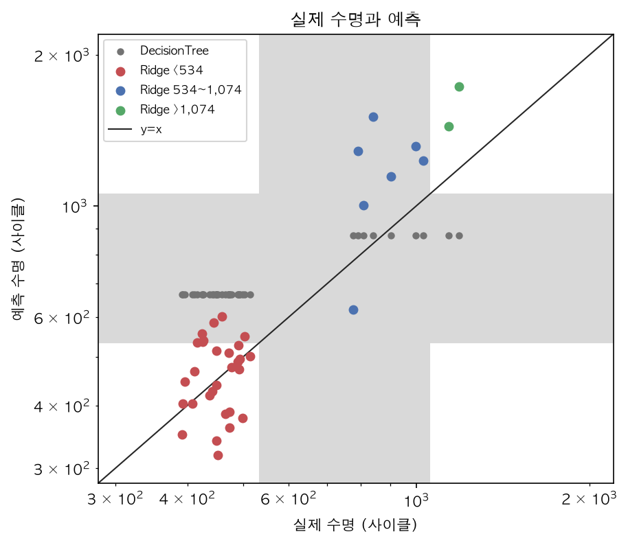
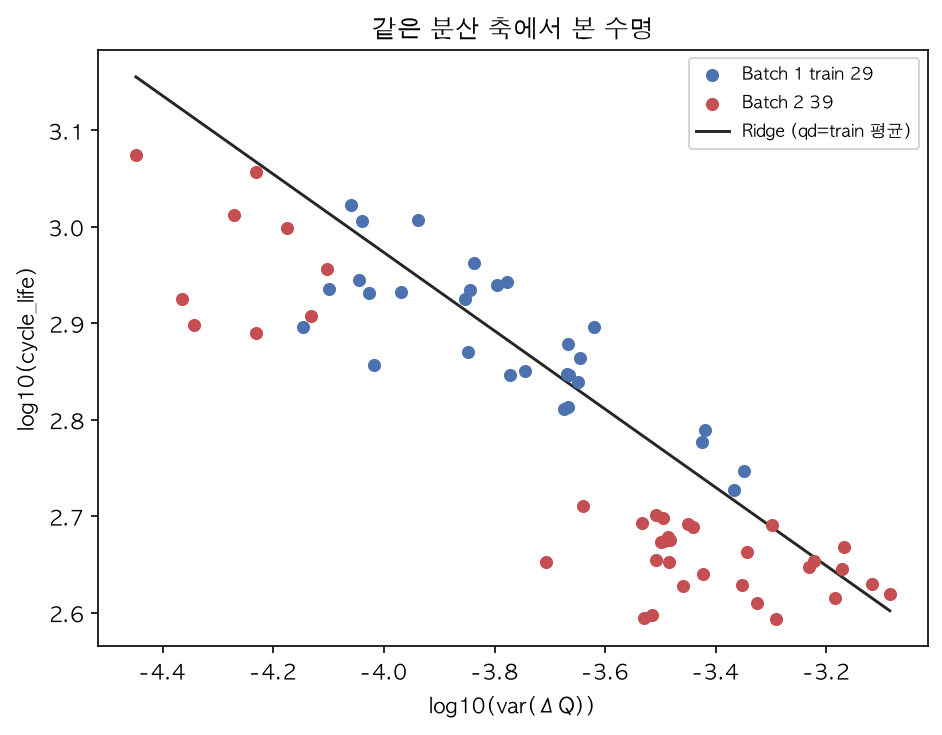

# ESS 배터리 수명 예측

초기 100사이클만으로 셀 수명을 예측해, 용량이 80%로 떨어지기 전에 교체 계획을 잡는다. ESS 교체 비용은 설비 투자(CAPEX)의 30~40%라, 짧은 셀을 일찍 가리는 일이 비용의 중심이다.

## 프로젝트 개요

데이터는 Severson et al. (2019) LFP/흑연 셀이다. Batch 1로 학습하고, Batch 2를 테스트로, Batch 3를 추가 검증으로 쓴다. 사용 셀은 119개(36/39/44)다. 태스크는 회귀이고, 학습 타깃은 `log10(cycle_life)`, 지표는 원래 사이클 수 MAPE(%)다. 원논문 Target은 9.1%다. [D01] [D11]

DAY 1 설계 원고: [reports/DS-MINI-Design-울산_4반-박연제.md](reports/DS-MINI-Design-울산_4반-박연제.md)

## 파일 구조

```
├── README.md
├── requirements.txt
├── .gitignore
├── data/
│   └── README.md                 # raw/, processed/ 는 로컬 전용
├── docs/                         # gitignore. 작업 기록
├── notebooks/
│   ├── 01_EDA.ipynb
│   ├── 02_feature_engineering.ipynb
│   └── 03_modeling.ipynb
├── src/
│   ├── config.py
│   ├── preprocess.py
│   ├── features.py
│   └── train.py
├── reports/
│   ├── DS-MINI-Design-울산_4반-박연제.md
│   ├── DESIGN_TRACE.md           # docs/DESIGN_TRACE.md 공개 복사본
│   └── figures/
└── results/
    ├── model_performance.csv
    ├── predictions_batch2.csv
    ├── predictions_batch3.csv
    └── final_model.joblib
```

## 환경 설정

```bash
python -m venv .venv
source .venv/bin/activate
pip install -r requirements.txt
```

원본 `.mat`는 `data/raw/`에 둔다. 파일 이름과 배치는 [data/README.md](data/README.md)에 있다.

```bash
python src/preprocess.py --batches 1 2 3
```

그다음 `notebooks/02_feature_engineering.ipynb`가 `features_batch{N}.csv`를 만든다. 이어서 `01_EDA.ipynb`, `02_feature_engineering.ipynb`, `03_modeling.ipynb` 순서로 연다. `data/raw/`, `data/processed/`, `.mat`, `.pkl`은 저장소에 올리지 않는다.

## EDA

질문별 핵심 발견이다. 그림은 `reports/figures/`에 있다.

| 질문 | 핵심 발견 |
| --- | --- |
| Q1 수명 분포 | Batch 1은 534~1,074(중앙 772). Batch 2의 30/39가 534 미만이고, 1,074 초과는 Batch 2가 2셀, Batch 3가 16셀이다. [Q1] |
| Q2 열화 곡선 | 사이클 100 방전용량은 단수명 1.100Ah, 장수명 1.069Ah다. 초기 100사이클 기울기는 1e-5 Ah/사이클 수준이라 평탄하고, 가속은 그 뒤다. [Q2] |
| Q3 ΔQ(V) | log10(var(ΔQ))와 log10(수명)은 전체 Pearson −0.90, Spearman −0.89. Batch 1은 −0.84 / −0.83, R² 0.71. 수명 700~1,100의 3.0V ΔQ는 Batch 1 −0.031Ah, Batch 3 −0.024Ah. [Q3] |
| Q4 충전 조건 | Batch 1 평균 C-rate와 log 수명의 r은 −0.53이고, Batch 2는 −0.04, Batch 3는 −0.05다. 같은 4.8C(80%)-4.8C 중앙 수명은 753 / 492 / 809 / 1,640이다. [Q4] |
| Q5 상관 | Batch 1 1위는 log10(var) −0.84. log10(min 절댓값)과 r=0.996이라 탈락. 잔차에서 세 배치 부호가 같은 추가 신호는 qd_max_minus_2뿐(−0.53/−0.63/−0.43). [Q5] |
| 배치 비교 | newstructure는 Batch 1이 0, Batch 2가 9, Batch 3가 44 전부다. 같은 수명에서도 Batch 1의 ΔQ 골이 더 깊다. 정규화 깊이 비는 1.30에서 1.29로만 줄었다. |

## Modeling

### 피처

| 피처 | 계산식 | 근거 |
| --- | --- | --- |
| log10(var(ΔQ)) | Qdlin 행 99 − 행 9, 1,000점 분산(ddof=1)에 log10 | [Q3] [Q5] [D09] |
| qd_max_minus_2 | 사이클 2~100 QD 최댓값 − 사이클 2 QD. 단발 스파이크만 앞뒤 중앙값으로 보정 | [Q5] [D10] |

배제한 것은 log10(min 절댓값), 2V 값, skew, 정책·chargetime, 배치 번호, 정규화 ΔQ, knee다. 정규화 ΔQ는 오프셋을 줄이지 못했다. [D12] [D17] [D19]

### 데이터 분할

같은 충전 프로토콜이 train과 hold-out에 동시에 들어가면 프로토콜이 새는 것처럼 보인다. Batch 1을 `policy_readable` 그룹 `GroupShuffleSplit`(test_size 0.2, `RANDOM_STATE=42`)으로 나눴다. [D22]

| 구분 | 셀 | 정책 | 수명 |
| --- | --- | --- | --- |
| train | 29 | 16 | 534~1,054 |
| hold-out | 7 | 4 | 617~1,074 |

정책 겹침은 0이다. 셀 비율 19.444%는 정책 20종의 20%를 나눈 결과다. 튜닝과 Train MAPE는 train 29셀 안 `GroupKFold(5)`만 쓴다. [D23]

### 후보와 최종 모델

선택 규칙은 결과를 보기 전에 고정했다. 최종 모델은 ElasticNet, Ridge, Lasso 중에서만 고른다. GroupKFold 평균 MAPE가 가장 낮은 쪽을 택하고, 다른 메인이 0.5%p 안이면 Valid가 낮은 쪽을 택한다. Valid만으로 잠그지 않는다. 비교군은 선택에 넣지 않는다. [D23] [D31]

| 모델 | 역할 | Train MAPE | Valid MAPE |
| --- | --- | --- | --- |
| Ridge (alpha=1e-06) | 메인, 최종 | 6.657±1.217 | 4.888 |
| Lasso (alpha=1e-07) | 메인 | 6.657±1.217 | 4.889 |
| ElasticNet (alpha=1e-07, l1_ratio=0.1) | 메인 | 6.657±1.217 | 4.888 |
| DecisionTree (max_depth=1) | 비교군 | 10.016±3.912 | 9.354 |
| XGBoost (depth 2, 50 trees, lr 0.05) | 비교군 | 9.261±2.072 | 10.068 |
| LinearRegression(log10_var) | 비교군 | 8.874±1.538 | 8.465 |

세 메인의 차이는 CV 0.000010%p, Valid 0.000007%p다. Ridge는 계수를 0으로 만들지 않아 설계 피처 두 개가 남는다. 스케일 후 계수는 log10_var −0.089, qd_max_minus_2 −0.041, 절편 2.884이고, 5개 폴드 모두 음수다. [D32] [D41]

### 정규화 강도

alpha를 격자 하한까지 내려도 작은 alpha 구간의 Train MAPE는 평탄하다. Ridge는 1e-06~1e-03에서 변화 0.000171%p다. 피처를 2개로 잠그고 공선 피처를 뺀 뒤라, L1·L2가 추가로 줄일 분산이 작았다. 설계가 정규화 모델을 메인으로 둔 이유 가운데 외삽과 계수 해석은 그대로다. [D26] [D35] 그림은 `reports/figures/modeling_alpha_curve.png`다.

### 딥러닝을 쓰지 않은 이유

학습에 쓰는 셀은 29개다. 파라미터 수가 셀 수를 넘기 쉽고, 수명 범위 밖은 선형 모델이 외삽한다. 비교군 트리는 학습한 수명 밖으로 나가지 못한다. [D27] [D28]

### 설계 대비 구현

추적 표는 [reports/DESIGN_TRACE.md](reports/DESIGN_TRACE.md)다. `docs/`는 저장소에서 빠지므로 같은 파일을 여기에 복사했다.

| 단계 | 설계 수치와 일치한 항목 | 대표 수치 |
| --- | --- | --- |
| P8 | 18 | 스파이크 보정 22점. Batch 1 R² 재현 0.712(설계 0.71). 두 피처 VIF 1.726(설계 1.73) |
| P11 | 2 | 수명 700~1,100의 3.0V 중앙 ΔQ. Batch 1 −0.0312→−0.031, Batch 2 −0.0209→−0.021 |
| P12 | 4 | 사용 셀 44, 1,074 초과 16, 3.0V −0.0241→−0.024, Batch 1 train newstructure 0 |

구체화 기록은 설계에 없던 세부값이다. 오류 구간은 세 칸, GroupKFold는 5, 비교군은 DecisionTree와 XGBoost, ΔQ 분산은 ddof=1, alpha 격자 하한은 평탄 구간을 보려고 넓혔다. Q4의 중앙 수명 네 값은 집단이 적혀 있지 않아 보류했다. 설계 변경은 하나다. 원고 첫 문단의 124셀은 오기고, DAY 2 산출물은 사용 119셀(36/39/44)이다.

| 설계 예상 | 결과 |
| --- | --- |
| Batch 2의 30/39는 534보다 짧다 | 30셀. Ridge MAPE 15.121, 평균 부호 +1.124 |
| 534 이상은 과대예측 | 534~1,074은 +31.999, 1,074 초과 Batch 2는 +36.277 |
| 534 미만 상쇄 | qd_max_minus_2 기여. 단일 피처 평균 부호 +33.865 → Ridge +1.124 |
| Batch 3의 16셀은 1,074보다 길다 | 16셀. 평균 부호 +17.812. 최장 b3c38은 −22.712 |
| 3.0V ΔQ 오프셋 | Batch 1 −0.031, Batch 2 −0.021, Batch 3 −0.024. 모두 소수 셋째에서 일치 |
| 트리는 학습 범위 밖을 예측하지 못함 | Batch 2 최소 666.987. Batch 3 최대 872.099 |

## 성능 결과

Gap(A-B) = B − A 이고, 양수면 나빠진 것이다. Gap(Target-Test) = Test − 9.1.

| 구분 | MAPE (%) | 비고 |
| --- | --- | --- |
| Train (Batch 1 CV) | 6.657 | 29 / 7 / 39. GroupKFold 평균. 학습 셀 29 |
| Valid (Batch 1 Hold-out) | 4.888 | 29 / 7 / 39. hold-out 셀 7 |
| Test (Batch 2) | 20.259 | 29 / 7 / 39. 테스트 셀 39 |
| Gap (Train-Valid) | -1.769 | 29 / 7 / 39. (+) : 과적합 의심 |
| Gap (Valid-Test) | 15.371 | 29 / 7 / 39. (+) : 배치간 일반화 저하 의심 |
| Gap (Target-Test) | 11.159 | 29 / 7 / 39. Target : 원논문 9.1% |
| Test (Batch 3) | 24.945 | 테스트 셀 44 |
| Gap (Batch2-Batch3) | 4.686 | 테스트 배치 간 비교 |
| Gap (Target-Test, Batch 3) | 15.845 | Target : 원논문 9.1% |

Gap(Train-Valid)가 음수인 것은 hold-out 7셀이 train보다 쉬운 쪽에 가깝다는 뜻이고, 7셀이라 과적합이 없다고 단정하지 않는다. Gap(Valid-Test) 15.371은 534 이상에서 수명을 길게 본 결과다. 같은 수명인데 Batch 2·3의 ΔQ 골이 Batch 1보다 얕아, Batch 1에서 배운 기울기가 작은 분산을 긴 수명으로 읽는다. Gap(Target-Test) 11.159는 원논문 9.1%와 학습·테스트 구성이 달라 직접 비교하지 않는다. Gap(Batch2-Batch3) 4.686은 Batch 3가 더 나쁜 폭이다. Batch 2 평균은 534 미만 30셀이 끌어내렸고, Batch 3에는 그 짧은 셀이 없다. [D30] [D33] [D39]

아래 표는 저장된 예측의 집계다. 모델 선택에는 쓰지 않았다. Batch 3에서는 비교군의 전체 MAPE가 Ridge보다 낮다. 선택 규칙은 Batch 2를 보기 전에 잠겼다.

| 모델 | Batch 2 | <534 (30) | 534~1,074 (7) | >1,074 (2) | Batch 3 | 534~1,074 (28) | >1,074 (16) |
| --- | --- | --- | --- | --- | --- | --- | --- |
| Ridge | 20.259 | 15.121 | 37.701 | 36.277 | 24.945 | 25.573 | 23.847 |
| DecisionTree | 39.953 | 48.096 | 9.328 | 24.984 | 18.471 | 9.540 | 34.099 |
| XGBoost | 39.921 | 48.483 | 9.349 | 18.493 | 16.857 | 9.849 | 29.122 |
| log10_var 단일 | 29.596 | 33.865 | 18.023 | 6.060 | 12.217 | 8.981 | 17.881 |

비교군이 Batch 3에서 더 낮은 이유. 모델 선택은 결과를 보기 전에 정한 규칙과 지정 테스트(Batch 2) 기준이다. Batch 2에서 Ridge 20.259, DecisionTree 39.953, XGBoost 39.921, log10_var 단일 29.596이라, 짧은 쪽 외삽이 필요한 배치에서 설계대로 선형 모델이 낮았다.  
Batch 3는 534 미만 셀이 0개라 아래쪽 외삽이 필요 없다. 트리·부스팅은 예측 최대 872.099 / 947.558에서 멈춰 긴 셀을 짧게 보는데, 이 방향이 ΔQ 오프셋에 의한 과대예측과 반대라 오차가 작게 나왔다.  
qd_max_minus_2의 효과는 배치마다 반대다. Batch 2는 단일 29.596에서 Ridge 20.259로 줄고, Batch 3는 단일 12.217에서 Ridge 24.945로 늘었다.  
두 테스트 배치를 모두 이기는 모델이 없다는 것은 오차의 본질이 모델 종류보다 피처의 배치 간 오프셋에 있다는 근거이고, 개선 방향 1(여러 배치 혼합 학습)로 이어진다.  
테스트 결과를 보고 모델·피처를 바꾸지 않았다. 테스트는 마지막 한 번이다.

| 배치 | 외삽 방향 | 셀 수 | Ridge MAPE | 트리 MAPE | 평균 부호 % |
| --- | --- | --- | --- | --- | --- |
| Batch 2 | 짧은 쪽 | 30 | 15.121 | 48.096 | +1.124 |
| Batch 3 | 긴 쪽 | 16 | 23.847 | 34.099 | +17.812 |



Ridge는 534 미만에서 y=x 주변에 있고, 534 이상은 직선 위로 올라간다. DecisionTree는 짧은 셀을 666.987 높이에 가로로 모은다. [D27]

## 오류 분석

Batch 2 Test 20.259는 534 이상 9셀의 과대예측(평균 부호 +31.999%, +36.277%)에서 커졌고, 534 미만 30셀은 +1.124%로 상쇄됐다. 그 상쇄는 qd_max_minus_2 기여(평균 −0.078)다. log10_var만 쓰면 그 구간 평균 부호가 +33.865%다. 3.0V 중앙 ΔQ는 Batch 1 −0.031, Batch 2 −0.021Ah다. ΔQ가 얕은 13셀의 Ridge MAPE는 28.531이다.

Batch 3 Test는 24.945다. 44셀 중 1,074 초과가 16개이고 534 미만은 0이라, 짧은 쪽 상쇄가 없다. 평균 부호는 +22.500%다. 트리는 872.099에서 멈춘다. 최장 b3c38(1,935)은 Ridge 1,495.521, 오차 −22.712%다.

오차가 큰 셀은 newstructure이고, 그 정책은 Batch 1 train 16종에 없다. Batch 2 상위는 b2c44, b2c9, b2c34로 3.0V ΔQ가 −0.019~−0.013Ah다. Batch 3 상위 5셀도 전부 newstructure이고, 3.0V ΔQ는 Batch 1 중앙 −0.031보다 얕다. D05로 테스트에 남긴 셀 가운데 Batch 2 오차 상위 5에 들어간 것은 b2c9뿐이다.

qd_max_minus_2는 짧은 쪽 과대예측을 +33.865%에서 +1.124%로 내리고, Batch 3의 1,074 초과에서는 단일 모델 −11.909%를 Ridge +17.812%로 키운다. 같은 교환이 전체 MAPE에도 있어, Batch 2는 단일 29.596에서 Ridge 20.259로 줄고 Batch 3는 12.217에서 24.945로 늘어 두 배치를 모두 이기는 모델은 없다. 테스트에서 이 교환이 보여도 피처를 바꾸지 않았다. 피처와 모델은 Batch 2를 보기 전에 잠겼기 때문이다.



수명 534~1,074에서 log10_var 중앙은 train 29셀 −3.777, Batch 2 7셀 −4.231이다. 같은 수명에서 Batch 2가 왼쪽(더 작은 분산)에 있다. [D30]

개선은 구현하지 않았다.

1. 학습 배치가 하나라 ΔQ 오프셋을 배울 수 없다. 여러 배치를 섞는 원논문 방식이 이 차이를 다룬다. [D30] [D33]
2. 정규화 ΔQ는 깊이 비를 1.30에서 1.29로만 바꿨다. 배치에 덜 민감한 피처를 더 볼 여지가 있다. [D17]
3. 새 배치의 초기 소수 셀로 절편만 다시 맞출 수 있다. 배치 번호를 피처로 넣는 것과는 다르다. [D30]

## ESS 도메인 해석

수명 534 미만 30셀의 평균 부호 오차는 +1.124%라, 짧은 셀을 한쪽으로 치우치지 않고 가린다. 이 식별은 예방 교체 계획과 제조 수율 선별에 쓸 수 있다.

긴 수명을 길게 보는 오차는 위험하다. 아직 괜찮다고 판단하면 교체가 늦어진다. 운영에서는 예측 수명에 보수적 여유를 두고, 새 배치의 초기 셀로 절편만 다시 맞춘다.

한계는 학습 배치가 하나이고 학습 셀이 29개라는 점, 실험실 LFP 한 화학이라는 점, newstructure라는 실험 구조가 Batch 1 train에 0개라는 점, 원논문과 학습·테스트 구성이 다르다는 점이다.

실배포에서는 운영 데이터로 다시 학습한다. Data Drift는 성능이 떨어지기 전에, 새 배치의 log10_var 분포가 train 범위(−4.146~−3.350)에서 벗어나는지로 본다. Batch 3는 그 아래 셀이 24개였다. Model Drift는 잠긴 Ridge의 Valid 4.888 대비 이후 배치 MAPE가 벌어지는지로 본다. 새 배치의 분산이 train 범위를 벗어나거나 Gap(Valid-Test)가 다시 커지면 재학습한다. 배치 번호 자체는 피처로 넣지 않는다.

## 참고문헌

Severson, K. A. et al. (2019). Data-driven prediction of battery cycle life before capacity degradation. Nature Energy, 4, 383–391.

## 팀 구성

1인 (박연제 : 전체 수행)
