# ESS 배터리 수명 예측 — DAY 1 모델 설계

SKALA 울산캠퍼스 4반 · 박연제 · 2026-10-01

> **핵심 요약**
>
> - 초기 100사이클의 방전용량으로는 수명이 나뉘지 않았다. 오히려 단수명 셀이 0.031Ah 더 높았다. 대신 사이클 10과 100의 방전 곡선 차이인 ΔQ(V)의 분산이 로그 수명과 r=-0.90으로 강하게 연결된다는 것을 확인했다.
> - 테스트 배치(Batch 2)는 39셀 중 32셀이 학습 수명 범위(534~1,074) 밖이었다. 하여 범위 밖도 예측할 수 있는 정규화 선형모델을 메인으로, 트리 계열은 비교군으로 정했다.
> - 충전 속도는 같은 배치 안에서만 수명과 관련 있고 배치가 바뀌면 관계가 사라졌다. 그래서 충전 '조건'이 아니라 셀 내부 '상태'를 보여주는 피처 2개(log10(var(ΔQ)), qd_max_minus_2)를 최종 선택했다.
> - 같은 수명이어도 학습 배치의 ΔQ 골이 더 깊어서, DAY 2에서는 테스트 셀의 수명을 과대예측하는지를 핵심 리스크로 점검한다.

데이터: Severson et al., _Nature Energy_ (2019), LFP/흑연 124셀. 분석 단위는 셀 1행. 사용 셀은 Batch 1 36, Batch 2 39, Batch 3 44.

## 1. 분석 목적

ESS 배터리 교체비는 설비투자비(CAPEX)의 30~40%다. 수명을 모르면 갑작스러운 중단과 이른 교체가 같이 생긴다. 초기 100사이클만으로 수명(`cycle_life`)을 회귀 예측해 교체 시점을 미리 잡는다.

태스크는 회귀만 한다. 학습 타깃은 `log10(cycle_life)`이고, 지표 MAPE는 원래 사이클 수로 계산한다. 원논문 목표 MAPE는 9.1%다.

### 가설과 데이터 정의

가설은 이렇다. 수명을 가르는 열화는 용량이 줄기 전에, 방전 곡선의 형태 변화로 먼저 나타난다.

| 항목      | 조작적 정의                                                 |
| --------- | ----------------------------------------------------------- |
| Y         | `cycle_life`. SOH 80%에 도달한 사이클. ESS 업계의 교체 기준 |
| X         | 초기 100사이클에서 만든 셀 단위 피처                        |
| 분석 단위 | 셀 1개 (1행)                                                |
| 척도      | 비율척도. 사이클 수                                         |

초기 100사이클을 쓰는 이유는 수명의 약 10~25% 시점에서 교체 계획을 세우려는 업무 목적이다. Batch 1 중앙 수명 772사이클의 100사이클은 약 13%다. Qdlin을 쓰는 이유는 전압축 1,000점으로 맞춰져 있어, 사이클마다 같은 전압 지점을 비교할 수 있기 때문이다.

## 2. 데이터 개요와 정제

원본 `.mat`은 필요한 필드만 변환했다. 행은 지우지 않고 `use=False`로 표시한다. 공칭 1.1Ah의 80%는 0.88Ah다. 정상 종료 셀의 최저 방전용량은 0.880~0.885Ah이고, 0.90Ah보다 높으면 80%에 닿기 전에 실험이 끝난 것으로 본다.

| 배치 | 원래 | 제외 | 최종 | 제외 사유                                               |
| ---- | ---: | ---: | ---: | ------------------------------------------------------- |
| 1    |   46 |   10 |   36 | 80% 미도달. b1c0~b1c4, b1c8, b1c10, b1c12, b1c13, b1c22 |
| 2    |   47 |    8 |   39 | `cycle_life` 결측. b2c22, b2c23, b2c35~b2c40            |
| 3    |   46 |    2 |   44 | `cycle_life` 결측. b3c23, b3c32                         |

b1c0~b1c4의 저장 수명은 수명 종료가 아니다. 대응을 의심한 b2c7, b2c8, b2c9, b2c15, b2c16과 비교하면, b2 첫 10사이클 방전용량이 b1 마지막 10사이클보다 0.053~0.098Ah 높고 정책 숫자도 다르다. 연속 실험이 아니므로 수명을 합치지 않고 b1 다섯 셀만 제외한다. b2 다섯 셀은 테스트에 남긴다.

b3c37(수명 1,390)은 유지한다. 사이클 597~598에서 방전용량이 약 0.07Ah 올랐다가 599에서 원래 궤적으로 돌아온다. 두 사이클 스파이크이고 초기 100사이클 밖이다.

피처를 만들기 전에 summary의 단발 스파이크만 앞뒤 중앙값으로 바꾼다. 기준은 열마다 고정이다. 용량 0.20Ah(앞뒤 차이 0.05Ah 이하), IR 0.005Ω, 온도 5°C, chargetime 30. 학습 데이터로 임계값을 맞추지 않으므로 누수가 없다. 사용 셀에서 바뀐 점은 22개다. Batch 1이 10, Batch 2가 12, Batch 3이 0이다. b1c18 사이클 40 방전용량 2.884Ah는 1.069Ah로 바뀌고 셀은 남긴다. pkl 원본은 수정하지 않는다.

ΔQ(V) = Qdlin 행 99 − 행 9다. 행 k는 사이클 k+1이므로 사이클 100과 10이다. 사용 셀 119개의 두 행은 모두 유한하다. Vdlin은 세 배치가 같고 3.5V에서 2.0V까지 1,000점이다.

## 3. EDA

### Q1. Cycle Life 분포

**목적.** 학습 배치의 수명 범위 안에 Batch 2·3이 들어오는지, 장수명과 단수명이 어디에 몰리는지 확인한다.

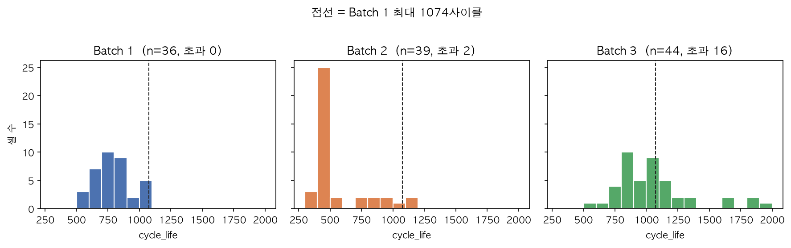

**결과.** 사용 셀 Batch 1은 534~1,074(중앙 772, 왜도 0.30)다. Batch 2 중앙은 472이고 30/39가 534 미만이다. 1,074를 넘는 셀은 Batch 2가 2, Batch 3가 16(최장 1,935)이다. 세 배치 모두 하한 IQR 이상치는 없다.

| 배치 |   n |   평균 | 중앙값 | 표준편차 | 변이계수 |   IQR | 최소 | 최대 |
| ---- | --: | -----: | -----: | -------: | -------: | ----: | ---: | ---: |
| 1    |  36 |  788.4 |  772.5 |    148.7 |     0.19 | 190.5 |  534 | 1074 |
| 2    |  39 |  565.7 |  472.0 |    222.2 |     0.39 |  69.0 |  392 | 1186 |
| 3    |  44 | 1059.7 | 1005.5 |    313.9 |     0.30 | 327.2 |  541 | 1935 |

| 배치 |   n | 장수명 >1,000 | 단수명 <500 |
| ---- | --: | ------------: | ----------: |
| 1    |  36 |       5 (14%) |      0 (0%) |
| 2    |  39 |        3 (8%) |    28 (72%) |
| 3    |  44 |      23 (52%) |      0 (0%) |

**해석.** 테스트의 다수는 학습이 한 번도 보지 못한 짧은 수명이다. Batch 3는 반대로 학습 최대를 넘긴다. 로그를 취하면 왜도가 Batch 1은 0.30에서 -0.01, Batch 3은 1.26에서 0.52로 준다. Batch 2는 1.64에서 1.36이라 400대 셀과 newstructure 장수명의 이봉이 남는다. 최단 셀의 log10(var(ΔQ))는 Batch 1 b1c20·b1c21(534·559, 5.4C(80%)-5.4C)이 -3.37·-3.35로 배치 중앙 -3.79보다 분산이 크고, Batch 3 b3c28·b3c6(541·667, 3.7C(31%)-5.9C-newstructure)도 -3.45·-3.53으로 중앙 -4.18보다 크다. Batch 2 b2c19(392, 6C(60%)-3C)는 -3.29로 중앙 -3.49보다 조금 크지만, b2c6(393, 3.6C(9%)-5C)은 -3.53으로 중앙과 거의 같다. 짧은 수명의 상당수는 ΔQ 분산으로 보이고, Batch 2의 최단 집단은 분산만으로 다 갈리지는 않는다.

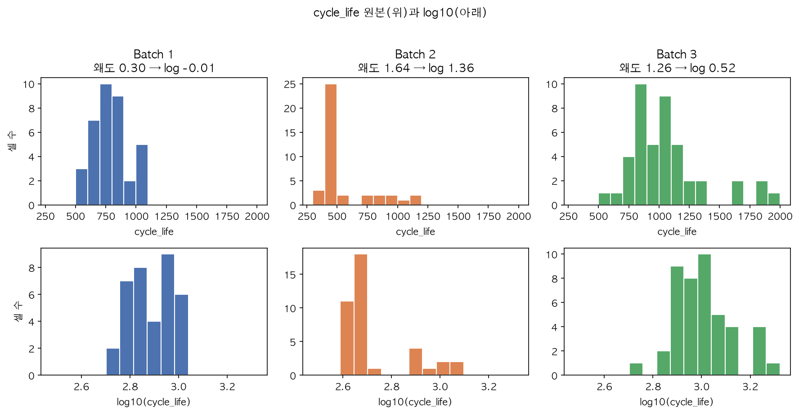

**시사점.** 학습은 `log10(cycle_life)`, MAPE는 원래 사이클 수다. 트리는 학습 타깃 밖을 예측하지 못하므로 메인은 외삽이 되는 정규화 선형모델이고, 트리·부스팅은 비교군이다. [Q1]

**ESS 의미.** 짧은 수명 셀이 섞인 운영 환경에서는 학습 범위를 넘는 예측이 필수다.

### Q2. 열화 곡선

**목적.** 수명 차이가 초기 100사이클 방전용량에 이미 보이는지, knee가 그 구간 안에 있는지 확인한다.

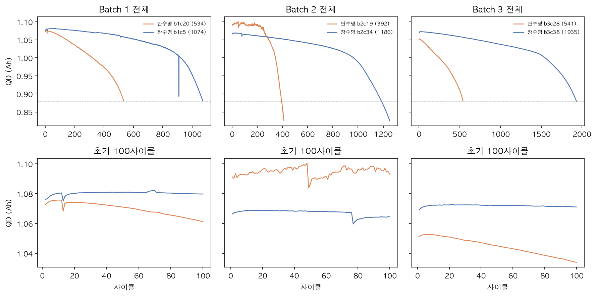

**결과.** 사이클 100 방전용량 중앙은 장수명(>1,000) 1.069Ah, 단수명(<500) 1.100Ah다. 짧은 셀이 0.031Ah 더 높다. 사이클 2~100 기울기는 둘 다 1e-5 Ah/사이클 수준이고, 100~400에서는 단수명이 약 8배 가파르다. 사용 셀의 사이클 100 방전용량 범위는 0.082Ah뿐이다.

**해석.** 초기 100사이클의 방전 끝 용량은 아직 형성 직후 수준이다. 수명을 가르는 가속은 그 뒤에 온다. 두 직선으로 잡은 knee는 수명의 78%(r=0.99)이고, 단수명 knee 중앙도 348사이클이라 초기 구간 밖이다.

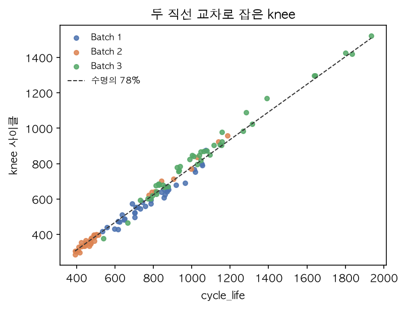

**시사점.** 초기 용량 스칼라만으로는 수명을 예측할 수 없다. ΔQ(V)가 필요하다. knee는 검토 후 누수로 배제한다. [Q2]

**ESS 의미.** 용량(SOH) 모니터링만으로 교체 시점을 판단하면 이미 늦다.

### Q3. ΔQ(V)

**목적.** ΔQ 분산이 로그 수명과 직선인지, 같은 수명인데도 배치마다 골 깊이가 다른지 확인한다.

ΔQ는 3.5V 근처에서 0이고 2.9V 근처에서 가장 음수다. 수명이 짧을수록 골이 깊다.

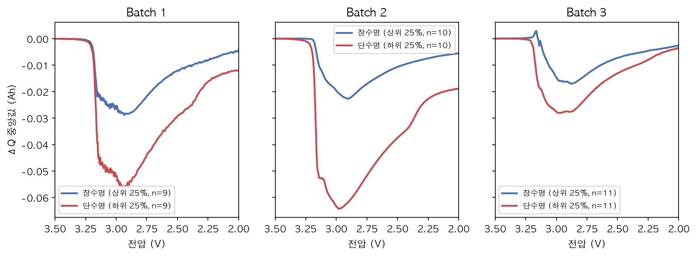

배치 안 하위 25%(단수명)와 상위 25%(장수명) 중앙 곡선의 최솟값은 Batch 1 -0.0563Ah(n=9) 대 -0.0288Ah(n=9), Batch 2 -0.0642Ah(n=10) 대 -0.0226Ah(n=10), Batch 3 -0.0281Ah(n=11) 대 -0.0170Ah(n=11)다. Batch 1에서도 단수명 골이 장수명보다 깊다.

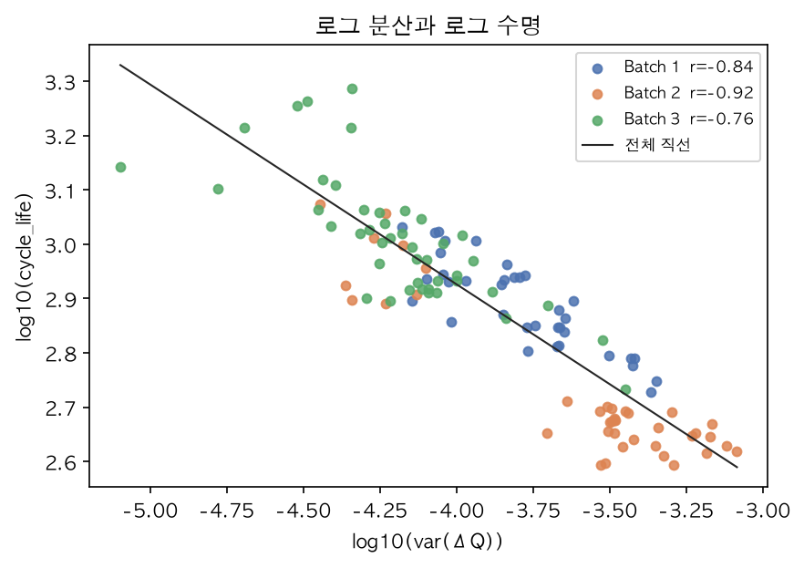

**결과.** 전체 119셀에서 log10(var(ΔQ))와 log10(수명)의 Pearson은 -0.897, Spearman은 -0.888이다. 학습 배치인 Batch 1은 -0.844와 -0.826, R² 0.71이라 직선에 가깝다. Batch 2 일반 셀 30개의 -0.375는 수명이 392~514(폭 122사이클)로 잘린 범위 제한이다.

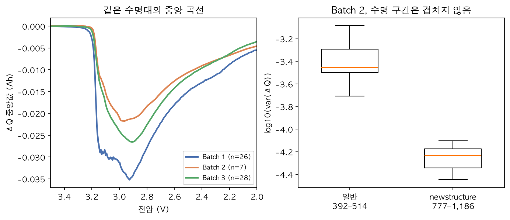

**해석.** 수명 700~1,100으로 맞춰도 3.0V 중앙 ΔQ는 Batch 1 -0.031Ah, Batch 2 -0.021Ah, Batch 3 -0.024Ah다. 골의 전압은 같고 깊이만 다르다. newstructure는 Batch 1이 0셀, Batch 2가 9셀, Batch 3가 44셀 전부라 배치 간 실험 방식 차이다. Batch 2 안에서는 수명 구간이 겹치지 않아 곡선 차이를 접미사만의 효과로 볼 수 없다.

**시사점.** 메인 신호는 log10(var(ΔQ))다. 배치 번호는 피처로 쓰지 않는다. Batch 1로 학습하면 ΔQ가 얕은 Batch 2·3 셀의 수명을 과대예측할 수 있고, 이것이 Gap(Valid-Test) = Test MAPE − Valid MAPE의 예상 원인이다. [Q3]

**ESS 의미.** 초기 진단 데이터만으로 조기 교체 대상 셀을 선별할 수 있는 근거다.

### Q4. 충전 조건

**목적.** 충전 속도가 수명을 가르는지, 그 관계가 테스트 배치에서도 유지되는지 확인한다.

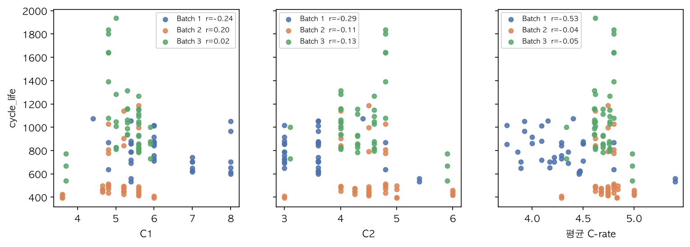

**결과.** 119셀 모두 `C1C(SOC%)-C2C` 또는 `-newstructure`로 파싱되고 실패는 0이다. 평균 C-rate와 log 수명의 Pearson은 Batch 1 -0.53, Batch 2 -0.04, Batch 3 -0.05다. 접미사를 뺀 전류식이 Batch 1에 없는 셀은 Batch 2 29/39, Batch 3 38/44다. 같은 `4.8C(80%)-4.8C`의 중앙 수명은 753, 492, 809, 1,640이다.

Batch 1 정책별 평균 수명. n=1은 경향만 본다.

| 구분 | 정책           |   n | 평균 수명 |
| ---- | -------------- | --: | --------: |
| 하위 | 5.4C(80%)-5.4C |   2 |     546.5 |
| 하위 | 8C(35%)-3.6C   |   2 |     607.5 |
| 하위 | 7C(40%)-3.6C   |   2 |     621.0 |
| 하위 | 7C(40%)-3C     |   2 |     676.0 |
| 하위 | 8C(25%)-3.6C   |   2 |     676.5 |
| 상위 | 6C(40%)-3C     |   2 |     935.5 |
| 상위 | 8C(15%)-3.6C   |   2 |    1008.5 |
| 상위 | 6C(30%)-3.6C   |   1 |    1014.0 |
| 상위 | 5.4C(40%)-3.6C |   1 |    1054.0 |
| 상위 | 4.4C(80%)-4.4C |   1 |    1074.0 |

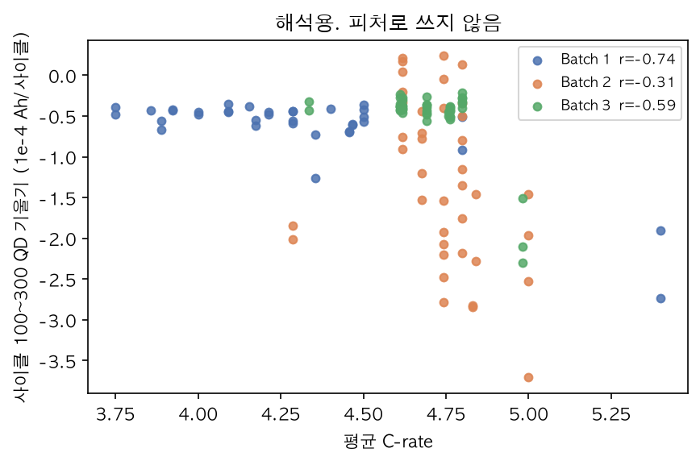

평균 C-rate와 사이클 100~300 방전용량 기울기의 Pearson은 Batch 1 -0.74, Batch 2 -0.32, Batch 3 -0.59다. 평균 속도가 높을수록 이 구간의 용량이 더 빨리 줄어든다. 이 기울기는 사이클 100 이후 정보라 누수이므로 피처로 쓰지 않고, 고속 충전이 중반 열화로 이어지는지 보는 해석용이다.

**해석.** 같은 배치 안에서는 고속 충전이 수명을 줄인다. 배치가 바뀌면 그 관계가 사라진다. 전류 숫자는 충전 조건이고, 셀 안에 쌓인 열화의 결과가 아니다. 초기 5회 chargetime도 Batch 1에서만 평균 C-rate의 대리변수다(r=-0.90).

**시사점.** C1, 전환 SOC, C2, 평균 C-rate, 초기 chargetime은 메인 모델에 넣지 않는다. 메인 피처는 ΔQ(V)다. [Q4]

**ESS 의미.** 충전 정책만으로 수명을 보증할 수 없으므로 셀 단위 진단이 필요하다.

### Q5. 상관과 피처 선별

**목적.** var 외에 추가 정보가 있는 피처가 있는지, 공선으로 빼야 할 쌍이 있는지 확인한다.

후보와 log10(수명)의 Batch 1 1위는 log10(var) -0.844, 2위는 log10(|min|) -0.821, 3위는 2V 값 +0.683이다. 이 셋은 Batch 2·3에서도 부호가 같다.

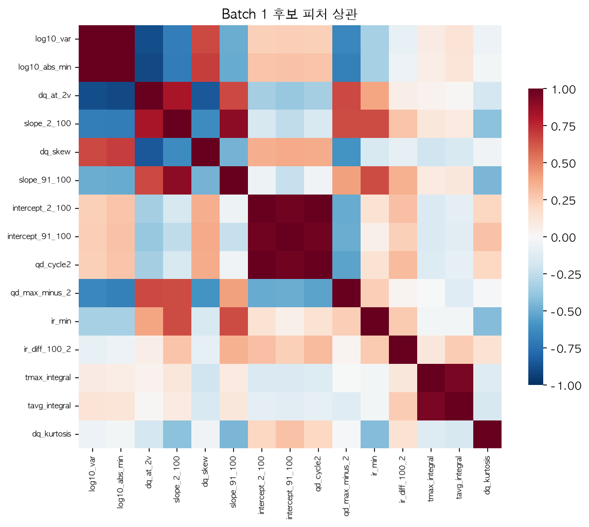

**결과.** Batch 1에서 log10(var)와 log10(|min|)의 상관은 0.996이고, 같이 넣으면 VIF가 689와 711이다. 2V 값은 var와 -0.885다. 용량 절편과 사이클 2 방전용량은 0.999, 온도 두 적분은 0.953이다.

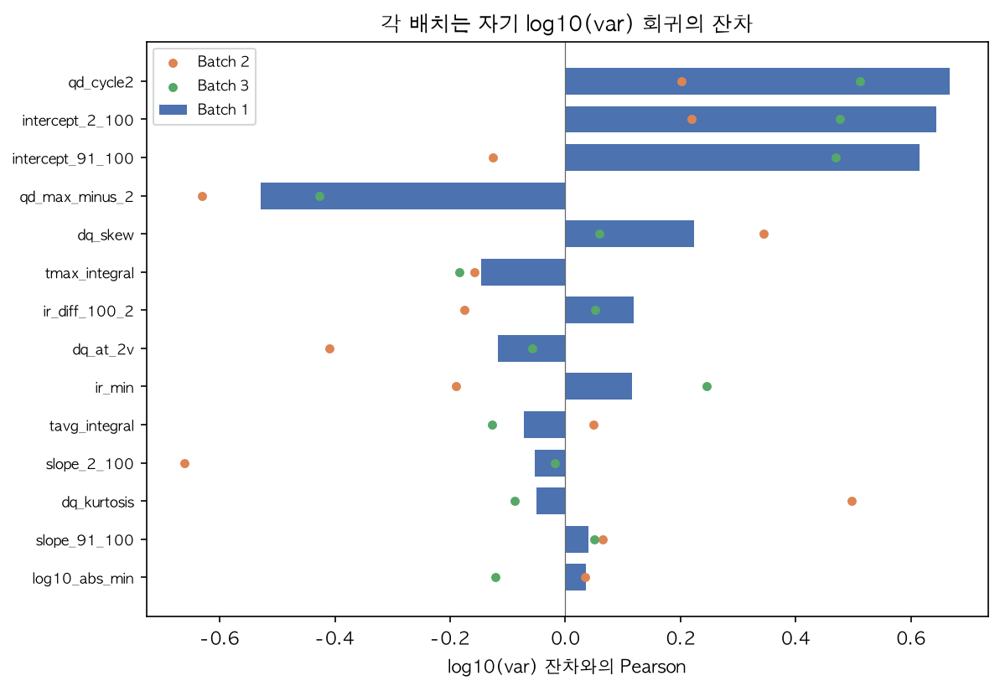

**해석.** var만으로 Batch 1 R²는 0.712다. |min|의 잔차 상관은 0.036이라 추가 정보가 없다. 잔차와 세 배치에서 부호가 같은 피처는 `qd_max_minus_2`(사이클 2~100 방전용량 최댓값 − 사이클 2)뿐이다. 잔차 상관은 -0.529, -0.631, -0.427이고, 둘만의 VIF는 1.73이다. 단순 상관은 Batch 1 +0.26, Batch 2 -0.31로 부호가 바뀌므로, var를 뺀 뒤에만 남는 신호다. 폭은 0.003~0.010Ah다. 사이클 10 방전용량으로 나눈 ΔQ는 같은 수명대 3.0V 깊이 비를 1.30에서 1.29로만 줄인다. 나누는 용량이 배치마다 1.07~1.10Ah로 비슷하기 때문이다.

**시사점.** 메인 피처는 log10(var(ΔQ))와 `qd_max_minus_2` 두 개로 확정한다. |min|, 2V 값, 정규화 ΔQ, 온도, IR, 기울기는 넣지 않는다. 학습 셀 36개에서 세 번째 피처는 공선이거나 배치에서 부호가 바뀐다. [Q5]

**ESS 의미.** 두 개의 해석 가능한 피처라 운영자가 예측 근거를 설명할 수 있다.

### 배치 간 비교

학습 수명 534~1,074 밖은 Batch 2 하한 30셀, 상한 Batch 2가 2셀·Batch 3가 16셀이다. 같은 수명에서도 Batch 1의 ΔQ 골이 더 깊고, 용량으로 나눠도 비율이 거의 그대로다. 정책 문자열의 대부분도 학습에 없다. 배치 번호로 이 차이를 보정하지 않는다. 오차는 DAY 2에서 수명 구간과 ΔQ 깊이로 나눈다. [Q1] [Q3] [Q4] [Q5]

## 4. Feature Engineering 전략

피처는 초기 100사이클만 사용한다. 스케일러는 `Pipeline` 안에서 학습 폴드에만 fit한다.

| 피처                                           | 근거                                                                                           | 채택                | EDA    |
| ---------------------------------------------- | ---------------------------------------------------------------------------------------------- | ------------------- | ------ |
| log10(var(ΔQ))                                 | 로그 수명과 r=-0.897. Batch 1 -0.844, R² 0.71. 세 배치에서 부호 유지                           | 채택                | Q3, Q5 |
| qd_max_minus_2                                 | var 잔차와 -0.53 / -0.63 / -0.43. 둘만의 VIF 1.73                                              | 채택                | Q5     |
| log10(절댓값 min ΔQ)                           | var와 r=0.996, 잔차 상관 0.036, VIF 689·711                                                    | 배제                | Q5     |
| ΔQ 2V 값, skew, kurtosis                       | 2V는 var와 r=-0.89. skew는 Batch 3에서 부호 반전                                               | 배제                | Q3, Q5 |
| 초기 QD 기울기·절편, 사이클 2 QD               | 사이클 100 QD는 단수명이 더 높음. 절편과 사이클 2 QD는 r=0.999. 기울기 부호는 Batch 2에서 반전 | 배제                | Q2, Q5 |
| knee                                           | 수명의 78% (r=0.99). 전체 곡선이 필요                                                          | 검토 후 누수로 배제 | Q2     |
| C1, 전환 SOC, C2, 평균 C-rate, 초기 chargetime | Batch 1 r=-0.53이 테스트에서 소멸. 같은 정책 수명 492~1,640                                    | 배제                | Q4     |
| 정규화 ΔQ, 배치 번호                           | 깊이 비 1.30→1.29. 배치 효과는 Batch 1만으로 추정 불가                                         | 배제                | Q3, Q5 |

### 최종 피처 정의서

| 피처명            | 계산식                                                   | 사용 데이터(사이클 범위, 인덱스) | 전처리                 | 수명과의 예상 방향       | 구현 위치       |
| ----------------- | -------------------------------------------------------- | -------------------------------- | ---------------------- | ------------------------ | --------------- |
| log10(var(ΔQ))    | ΔQ = Qdlin[행 99] − Qdlin[행 9]의 1,000점 분산에 log10   | 사이클 100 − 10. 행 99, 행 9     | 없음                   | 음(−)                    | src/features.py |
| qd_max_minus_2    | 사이클 2~100 QD 최댓값 − 사이클 2 QD                     | summary QD, 사이클 2~100         | correct_summary_spikes | log10(var) 통제 후 음(−) | src/features.py |
| log10(cycle_life) | log10(cycle_life). 예측 후 10의 거듭제곱으로 되돌려 MAPE | cycle_life (타깃)                | 없음                   | 타깃                     | src/train.py    |

DAY 2 코드는 이 정의서를 그대로 구현하고, 각 함수 주석에 이 표의 피처명을 표기한다.

## 5. 분석 과정의 판단 기록

EDA 결과를 보고 가설을 세우고, 데이터로 검증해 채택·기각한 과정이다.

| 판단 대상           | 처음 가설                                       | 검증 방법과 결과                                          | 최종 결정   | 근거 EDA |
| ------------------- | ----------------------------------------------- | --------------------------------------------------------- | ----------- | -------- |
| b1c0~b1c4 연속 실험 | 다음 배치로 이어진 같은 셀이라 병합할 수 있다   | 용량이 0.053~0.098Ah 오르고 충전 정책이 다르다            | 기각, 제외  | 정제     |
| knee 피처           | 수명과 r=0.99라 피처로 쓸 수 있다               | 수명의 78% 지점이라 끝부분 정보다                         | 누수로 배제 | Q2       |
| 충전 속도 피처      | Batch 1 r=-0.53이라 수명을 설명한다             | 테스트 배치에서 상관이 사라진다                           | 배제        | Q4       |
| ΔQ 정규화           | 용량으로 나누면 배치 간 골 깊이 차이가 줄어든다 | 3.0V 깊이 비 1.30→1.29                                    | 미사용      | Q5       |
| qd_max_minus_2      | 단순 상관이 약하고 부호가 바뀌어 빼야 한다      | log10(var) 잔차와는 세 배치 모두 음수다                   | 채택        | Q5       |
| log10 타깃          | 로그를 쓰면 분포가 안정된다                     | 왜도가 Batch 1은 0.30→-0.01, Batch 3은 1.26→0.52          | 확정        | Q1       |
| b3c37               | 용량이 튀면 셀을 제외한다                       | 사이클 597–598의 2사이클 스파이크고 초기 100사이클 밖이다 | 유지        | Q2       |

## 6. 회귀를 선택한 이유

ΔQ(V)는 사이클 100이 필요하다. 분류가 요구하는 초기 5사이클 조건에서는 이 피처를 쓸 수 없다. 회귀를 택해야 Q1~Q5가 모델로 이어진다. [Q3]

테스트 셀은 약 40개다. 분류 Accuracy는 셀 하나가 틀릴 때마다 2~3%p씩 움직인다. 수명을 숫자로 예측해야 교체 시점과 오차 구간을 말할 수 있고, MAPE로 Gap을 비교할 수 있다. [Q1]

## 7. Modeling Strategy

### 데이터 처리

- 타깃은 `log10(cycle_life)`. MAPE는 예측을 10의 거듭제곱으로 되돌린 사이클 수로 계산한다. 로그는 Batch 2의 이봉과 외삽을 없애지 못한다. [Q1] [Q3]
- 전처리는 `Pipeline(StandardScaler → 모델)`이다. 스케일러는 학습 폴드에서만 fit한다. 1행은 1셀이다.
- Batch 1(36셀, 정책 20종)을 `charging_policy` 그룹 `GroupShuffleSplit`으로 train 80% / hold-out 20%로 나눈다. `RANDOM_STATE=42`. 같은 충전 프로토콜이 train과 hold-out에 동시에 들어가지 않는다. [Q4]
- 튜닝과 Train MAPE는 train 80% 안 `GroupKFold`만 사용한다. Valid는 hold-out 20%(약 7셀)다.
- Batch 2는 모델과 하이퍼파라미터를 잠근 뒤 한 번만 평가한다. Batch 3는 선택 검증이다.

### 후보 모델

- **메인: ElasticNet, Ridge, Lasso** — ElasticNet은 L1·L2를 함께 써서 소표본에서 계수를 안정적으로 줄인다. 계수가 곧 피처 영향이라 해석이 쉽다. 학습 수명 밖을 외삽할 수 있다 [Q1]. log10(var)와 log 수명이 직선이다 [Q3]. 피처 2개, 학습 셀 36개라 정규화가 과적합을 막는다 [Q5]
- **비교군: 얕은 트리, 부스팅** — 학습 때 본 타깃 범위 밖을 예측하지 못한다. 수명 392인 셀도 534 이상으로만 나온다 [Q1]

딥러닝은 쓰지 않는다. 학습에 쓸 셀이 36개이고, 그 80%만 실제 학습에 들어간다. 파라미터 수가 셀 수를 넘기 쉽다. [Q1] [Q5]

## 8. 예상 리스크와 대응

- **외삽.** Batch 2의 30/39는 학습 최소 534보다 짧고, Batch 3의 16셀은 1,074보다 길다. 메인은 선형모델로 두고, 오차를 534 미만과 1,074 초과로 나눠 본다. 트리는 이 구간에서 비교만 한다. [Q1]
- **ΔQ 오프셋에 따른 과대예측.** 같은 수명인데 Batch 1의 ΔQ 골이 더 깊다. 정규화로 줄지 않았다. Batch 1로 학습한 모델은 Batch 2·3 수명을 길게 볼 수 있다. Gap(Valid-Test)가 양수면 이 차이를 먼저 의심한다. 배치 번호를 피처로 넣어 맞추지 않는다. [Q3] [Q5]
- **hold-out 불안정.** 정책 20종을 그룹으로 나누면 Valid가 약 7셀이다. Valid MAPE 한 장의 순위로 모델을 확정하지 않고, GroupKFold 평균과 함께 본다. [Q1] [Q4]
- **두 번째 피처의 단순 상관.** `qd_max_minus_2`의 수명 상관 부호는 배치마다 다르다. 계수가 불안정하면 var 하나만 둔 모델을 비교군으로 남긴다. [Q5]
- **원논문과 평가 조건 차이.** 원논문의 9.1%는 이번 과제와 학습·테스트 구성이 달라 직접 비교에 한계가 있다. 이번 과제는 Batch 1만으로 학습하고 분포가 다른 Batch 2를 테스트하므로 Gap(Target-Test)가 양수일 가능성이 높다. DAY 2에서는 이 차이를 배치 간 분포 차이로 해석한다. [Q1] [Q3]

## 9. DAY 2 계획

피처 2개로 `Pipeline`을 고정하고, train 80%의 GroupKFold로 ElasticNet·Ridge·Lasso의 정규화 강도를 고른다. hold-out으로 Valid MAPE를 보고 모델을 잠근 뒤 Batch 2를 한 번만 평가한다. Gap(Train-Valid)와 Gap(Valid-Test), Gap(Target-Test)= Test MAPE − 9.1을 같이 보고, 오차는 수명 구간과 ΔQ 깊이로 나눈다. Batch 3 평가는 그 다음 선택이다.
